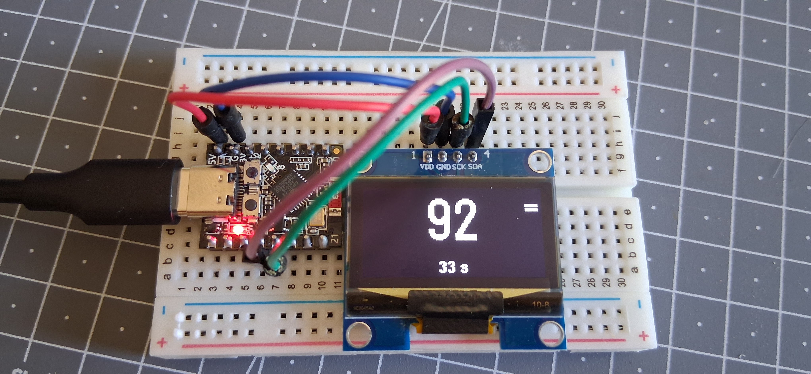
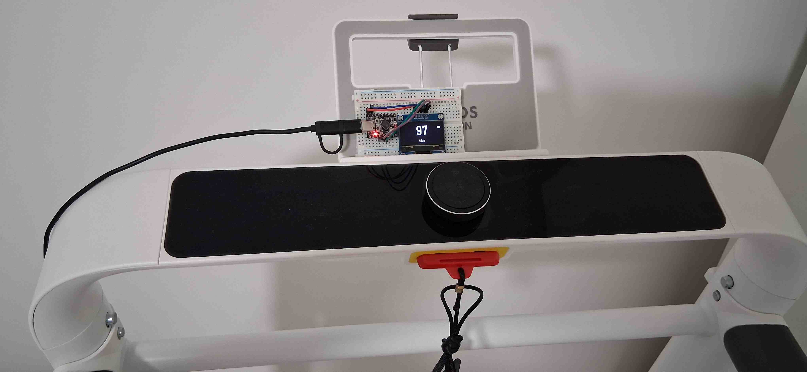

# Guide utilisateur — Libre Sport Display ESP32-C3

## 1. Présentation



**Libre Sport Display** est un petit afficheur déporté basé sur un **ESP32-C3** et un écran OLED I²C de 1,3 pouce.

Il récupère périodiquement la dernière mesure disponible depuis le service LibreLinkUp et affiche uniquement les informations utiles pendant une activité sportive :

- la mesure instantanée en grand ;
- la tendance ;
- l’âge de la mesure ;
- l’état de la connexion en cas de problème.

L’objectif est de pouvoir consulter rapidement la valeur pendant une séance de tapis de course ou de vélo sur Zwift, sans avoir à ouvrir l’application sur le téléphone.

> [!IMPORTANT]
> Ce projet est un afficheur secondaire de confort. Il ne remplace ni l’application officielle, ni ses alarmes, ni les recommandations d’un professionnel de santé.

---

## 2. Affichage

L’interface est volontairement très simple :

```text
┌─────────────────────┐
│              +      │
│        112          │
│        35 s         │
└─────────────────────┘
```




### Signification des tendances

| Code reçu | Affichage | Signification |
|---:|:---:|---|
| 1 | `--` | baisse rapide |
| 2 | `-` | baisse |
| 3 | `=` | stable |
| 4 | `+` | hausse |
| 5 | `++` | hausse rapide |

### Fraîcheur de la mesure

L’âge affiché sous la mesure permet de distinguer une donnée récente d’une donnée ancienne.

Exemples :

```text
35 s
```

```text
AGE 2 min
```

```text
ANCIEN 5 min
```

Lorsque le Wi-Fi est perdu, la dernière valeur valide reste visible :

```text
OFFLINE 4 min
```

Le programme privilégie le timestamp réel de la mesure lorsqu’il est disponible. Sinon, il affiche le temps écoulé depuis la réception de la donnée par l’ESP32.

---

## 3. Matériel nécessaire

- une carte ESP32-C3 ;
- un écran OLED I²C 1,3 pouce, 128 × 64 pixels ;
- contrôleur SH1106 dans la configuration actuelle ;
- quatre câbles Dupont ;
- une alimentation USB adaptée à l’ESP32-C3 ;
- un réseau Wi-Fi 2,4 GHz avec accès à Internet.

### Variante SSD1306

Si l’écran utilise un contrôleur SSD1306, remplacer dans le programme :

```cpp
U8G2_SH1106_128X64_NONAME_F_HW_I2C
```

par :

```cpp
U8G2_SSD1306_128X64_NONAME_F_HW_I2C
```

---

## 4. Câblage

Configuration utilisée dans le programme :

| Écran OLED | ESP32-C3 |
|---|---:|
| VCC | 3,3 V |
| GND | GND |
| SDA | GPIO 8 |
| SCL | GPIO 9 |

L’adresse I²C configurée est `0x3C`.

> [!CAUTION]
> L’ordre physique des broches peut varier selon le modèle d’écran. Vérifier les marquages `VCC`, `GND`, `SDA` et `SCL` imprimés sur le module avant de l’alimenter.

---

## 5. Logiciels nécessaires

### Arduino IDE

Installer une version récente de l’IDE Arduino, puis ajouter la prise en charge des cartes ESP32.

### Bibliothèques Arduino

Installer depuis le gestionnaire de bibliothèques :

- **U8g2** pour l’écran OLED ;
- **ArduinoJson** pour l’analyse des réponses JSON.

Les bibliothèques suivantes sont fournies avec l’environnement ESP32 :

- `WiFi` ;
- `WiFiClientSecure` ;
- `HTTPClient` ;
- `Wire` ;
- `time` ;
- `mbedtls`.

---

## 6. Réglages conseillés dans l’IDE Arduino

Les intitulés exacts peuvent varier selon la carte sélectionnée.

Réglages principaux :

```text
Carte : modèle ESP32-C3 correspondant à la carte utilisée
USB CDC On Boot : Enabled
Vitesse du moniteur série : 115200 bauds
Port : port série associé à l’ESP32-C3
```

Conserver les mêmes paramètres USB que ceux utilisés avec succès pour le test individuel du moniteur série.

---

## 7. Configuration personnelle

Dans la partie supérieure du programme, renseigner uniquement le bloc prévu à cet effet :

```cpp
// Réseau Wi-Fi de la maison
const char* WIFI_SSID = "NOM_DU_WIFI";
const char* WIFI_PASSWORD = "MOT_DE_PASSE_WIFI";

// Compte LibreLinkUp
const char* LIBRE_EMAIL = "ADRESSE_EMAIL_LIBRELINKUP";
const char* LIBRE_PASSWORD = "MOT_DE_PASSE_LIBRELINKUP";
```

### Recommandation pour un dépôt public

Ne jamais publier les identifiants réels dans GitHub.

Pour une version propre du dépôt, placer les secrets dans un fichier séparé nommé `secret.h` :

```cpp
#pragma once

const char* WIFI_SSID = "NOM_DU_WIFI";
const char* WIFI_PASSWORD = "MOT_DE_PASSE_WIFI";

const char* LIBRE_EMAIL = "ADRESSE_EMAIL_LIBRELINKUP";
const char* LIBRE_PASSWORD = "MOT_DE_PASSE_LIBRELINKUP";
```

Puis inclure ce fichier dans le programme principal :

```cpp
#include "secret.h"
```

Ajouter impérativement `secret.h` dans le fichier `.gitignore` :

```gitignore
secret.h
```

Il est également utile de fournir un modèle sans identifiants :

```text
secret.example.h
```

---

## 8. Organisation recommandée du dépôt

```text
Libre-Sport-Display/
├── LibreSportDisplay.ino
├── secret.example.h
├── .gitignore
├── README.md
├── USER_GUIDE.md
└── LICENSE
```

Le fichier réel `secret.h` reste uniquement sur l’ordinateur utilisé pour compiler le projet.

---

## 9. Premier démarrage

### Étape 1 — Vérifier le câblage

Contrôler les quatre connexions de l’écran :

```text
VCC → 3,3 V
GND → GND
SDA → GPIO 8
SCL → GPIO 9
```

### Étape 2 — Compiler et téléverser

1. connecter l’ESP32-C3 en USB ;
2. sélectionner la bonne carte ;
3. sélectionner le bon port ;
4. compiler le programme ;
5. téléverser le programme.

### Étape 3 — Ouvrir le moniteur série

Régler le moniteur série sur :

```text
115200 bauds
```

Puis appuyer une fois sur le bouton `RESET` de la carte si nécessaire.

Le début attendu ressemble à ceci :

```text
========================================
 ESP32-C3 LIBRE SPORT
 PORT SERIE OPERATIONNEL
========================================
Initialisation I2C...
Initialisation OLED...
OLED initialise
```

### Étape 4 — Vérifier le Wi-Fi

Lorsque la connexion fonctionne :

```text
Wi-Fi connecte
Adresse IP : 192.168.x.x
Puissance Wi-Fi : -xx dBm
```

### Étape 5 — Vérifier l’heure

Après synchronisation NTP :

```text
Heure NTP synchronisee
Heure ESP32 : 15:42:18
```

### Étape 6 — Vérifier LibreLinkUp

Le programme affiche ensuite les étapes suivantes :

```text
REQUETE LOGIN
RECUPERATION DU PATIENT
RECUPERATION DE LA MESURE
```

Lorsque tout fonctionne :

```text
Token recu correctement
Patient trouve : ...
MESURE RECUE AVEC SUCCES
Valeur : 112
Tendance affichee : +
Timestamp interprete : OUI
```

---

## 10. Fonctionnement réseau

Le programme suit cette séquence :

```text
Connexion Wi-Fi
      ↓
Synchronisation NTP
      ↓
Authentification LibreLinkUp
      ↓
Détection éventuelle du serveur régional
      ↓
Récupération du patient
      ↓
Récupération de la dernière mesure
      ↓
Actualisation toutes les 60 secondes
```

La valeur suivante définit la période d’interrogation :

```cpp
constexpr unsigned long API_INTERVAL_MS = 60000UL;
```

`60000` millisecondes correspondent à une minute.

---

## 11. Redirection régionale

La première authentification peut ne pas fournir directement le token. Le serveur peut d’abord demander une redirection vers une région spécifique.

Exemple de diagnostic :

```text
Redirection regionale demandee
Region demandee par LibreLinkUp : eu
Nouveau serveur : https://api-eu.libreview.io
```

Le programme recommence alors automatiquement l’authentification sur le serveur régional.

Régions prévues dans le code :

- `eu` ;
- `eu2` ;
- `fr` ;
- `de` ;
- `us` ;
- `ca` ;
- `ap` ;
- `au` ;
- `jp`.

---

## 12. Messages affichés sur l’OLED

| Message | Signification |
|---|---|
| `DEMARRAGE` | initialisation du programme |
| `CONNEXION WIFI` | tentative de connexion au réseau |
| `WIFI ABSENT` | réseau indisponible ou identifiants incorrects |
| `SYNCHRO HEURE` | synchronisation NTP en cours |
| `CONNEXION LIBRE` | authentification LibreLinkUp en cours |
| `TOKEN ABSENT` | aucune information d’authentification exploitable reçue |
| `PATIENT ABSENT` | aucun identifiant patient détecté |
| `LECTURE` | récupération de la mesure en cours |
| `LIVE` | dernière mesure récupérée avec succès |
| `SESSION EXPIREE` | nouvelle authentification nécessaire |
| `ERREUR SERVEUR` | réponse HTTP non valide |
| `JSON INVALIDE` | réponse reçue mais impossible à analyser |
| `MESURE ABSENTE` | bloc de mesure introuvable dans la réponse |

---

## 13. Dépannage

### Aucun message dans le moniteur série

Vérifier :

1. que le débit est réglé sur `115200` ;
2. que le bon port est sélectionné ;
3. que `USB CDC On Boot` est activé pour l’ESP32-C3 ;
4. que le même profil de carte que pour le test série fonctionnel est utilisé ;
5. qu’un redémarrage est effectué après l’ouverture du moniteur série.

Le programme attend brièvement l’initialisation USB au démarrage, mais il ne bloque pas indéfiniment si aucun moniteur série n’est ouvert.

### L’écran reste noir

Vérifier :

- l’alimentation 3,3 V ;
- la masse commune ;
- SDA sur GPIO 8 ;
- SCL sur GPIO 9 ;
- l’adresse `0x3C` ;
- le contrôleur SH1106 ou SSD1306 ;
- le résultat d’un scanner I²C.

Si l’écran est détecté à l’adresse `0x3D`, modifier :

```cpp
constexpr uint8_t OLED_ADDRESS = 0x3D;
```

### Message `WIFI ABSENT`

Vérifier :

- le nom exact du réseau ;
- le mot de passe Wi-Fi ;
- la présence d’un réseau 2,4 GHz ;
- la qualité du signal ;
- l’absence de portail captif.

### Message `TOKEN ABSENT`

Consulter la section complète :

```text
========== REPONSE LOGIN ==========
```

Les causes possibles sont notamment :

- une réponse de redirection régionale non reconnue ;
- une modification du format JSON ;
- une version d’API devenue incompatible ;
- une étape d’acceptation ou de validation attendue par le compte ;
- un compte LibreLinkUp ou un mot de passe incorrect ;
- une réponse d’erreur contenue dans un HTTP 200.

Ne jamais publier la réponse complète si elle contient un token, un identifiant de compte ou une donnée personnelle.

### Code HTTP 401

Cela indique généralement que la session n’est plus acceptée.

Le programme efface alors le token et l’identifiant patient afin de recommencer l’authentification lors de la prochaine tentative.

### Code HTTP négatif

Un code négatif provient généralement de la couche réseau de l’ESP32, par exemple :

- échec DNS ;
- délai dépassé ;
- connexion TLS impossible ;
- perte du Wi-Fi.

### `Timestamp interprete : NON`

La mesure peut tout de même être affichée. Dans ce cas, l’âge est calculé depuis la réception par l’ESP32 plutôt que depuis l’heure réelle de la mesure.

Pour prendre en charge un nouveau format, ajouter une variante dans la fonction :

```cpp
parseFactoryTimestamp()
```

### Valeur présente mais ancienne

L’âge affiché continue d’augmenter même si le serveur ne répond plus.

La dernière valeur n’est donc pas présentée comme une nouvelle mesure. L’écran affiche progressivement :

```text
35 s
AGE 2 min
ANCIEN 5 min
```

---

## 14. Diagnostic sans exposer les données sensibles

Pour demander de l’aide, copier uniquement :

- le code HTTP ;
- le champ `status` ;
- le message d’erreur ;
- la région demandée ;
- la structure générale du JSON après suppression des données sensibles.

Masquer systématiquement :

- l’adresse e-mail ;
- le mot de passe ;
- le token ;
- l’Account-Id ;
- l’identifiant du patient ;
- les données personnelles présentes dans la réponse.

Exemple de réponse nettoyée :

```json
{
  "status": 0,
  "data": {
    "redirect": true,
    "region": "eu"
  }
}
```

---

## 15. Sécurité HTTPS

La version de prototypage utilise :

```cpp
secureClient.setInsecure();
```

La communication reste chiffrée, mais le certificat présenté par le serveur n’est pas vérifié par l’ESP32.

Pour une version plus aboutie, remplacer cette configuration par la validation d’un certificat racine :

```cpp
secureClient.setCACert(rootCertificate);
```

Cette évolution nécessite de maintenir le certificat utilisé par le projet.

---

## 16. Bonnes pratiques GitHub

Avant chaque publication :

- vérifier que `secret.h` n’est pas suivi par Git ;
- rechercher toute adresse e-mail personnelle dans le dépôt ;
- rechercher tout mot de passe ;
- rechercher les chaînes commençant par un token ;
- supprimer les captures du moniteur série contenant des données sensibles ;
- fournir seulement `secret.example.h`.

Exemple de `.gitignore` :

```gitignore
# Identifiants locaux
secret.h

# Fichiers temporaires Arduino
*.bin
*.elf
*.map

# Fichiers système
.DS_Store
Thumbs.db

# IDE
.vscode/
```

---

## 17. Limites connues

- Le projet dépend d’un service distant et d’un accès Internet.
- Le format des réponses ou les points d’accès peuvent évoluer.
- Le projet utilise une API communautaire non garantie pour un appareil embarqué.
- L’actualisation distante peut être différente du rythme de production des mesures par le capteur.
- L’âge réel dépend de la présence et du format du timestamp dans la réponse.
- L’écran monochrome ne permet pas d’utiliser un code couleur.
- Le prototype ne vérifie pas encore le certificat TLS du serveur.

---

## 18. Utilisation pendant le sport

Avant une séance :

1. allumer l’ESP32-C3 ;
2. attendre l’affichage d’une valeur ;
3. vérifier que l’âge est faible ;
4. vérifier que la tendance est renseignée ;
5. conserver le téléphone et les alarmes officielles disponibles.

Pendant la séance, l’information la plus importante est l’âge de la donnée :

```text
112   +   35 s
```

Une mesure affichée avec `ANCIEN` ou `OFFLINE` ne doit pas être interprétée comme une donnée actuelle.

---

## 19. Résumé rapide

```text
Valeur  : mesure la plus récente reçue
Tendance: --, -, =, + ou ++
Age     : ancienneté de la mesure
LIVE    : récupération réussie
OFFLINE : dernière mesure conservée, réseau indisponible
```

Le projet est conçu pour rester simple, immédiatement lisible et utilisable sans interaction pendant une activité sportive.
